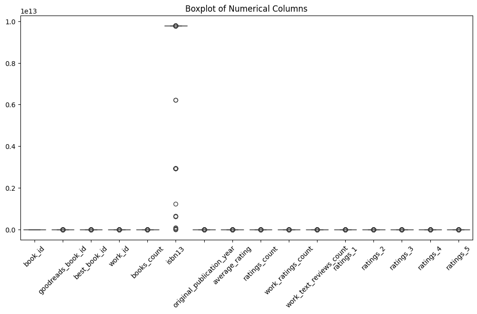

# Goodreads Books Dataset Analysis

Welcome to the analysis of the Goodreads Books dataset! This dataset offers a treasure trove of information on various books, including their ratings, reviews, authors, and publication details. With a total of 10,000 entries, each record captures essential attributes that are invaluable for understanding trends in book popularity and reader preferences.

## Data Overview

### Numerical Columns
The dataset contains several numerical columns that provide quantitative insights into the books. Let’s explore the numerical columns in detail:

- **book_id**: An identifier for each book entry. Its values range from 1 to 10,000 with a mean of 5,000. This uniform distribution lends itself to easy indexing.
- **goodreads_book_id, best_book_id, work_id**: All of these IDs provide unique identifiers across different platforms, reflecting a similar range and generally low correlation with ratings.
- **books_count**: This indicates the number of editions available for a specific book. The average count of 2.37 suggests many books have multiple editions.
- **isbn13**: A standard identifier for books. Missing values in this column suggest that some books might not have a standardized identification.
- **original_publication_year**: This column tracks the year a book was first published. The average publication year illustrates the historical breadth of the dataset.
- **average_rating**: A crucial metric that reflects the overall reader satisfaction, with a mean of 4.08.
- **ratings_count**: Reflects how many times the book has been rated on Goodreads, which is essential for assessing a book's popularity.
- **work_ratings_count**: Similar to ratings count, but reflects the cumulative ratings across all editions.
- **work_text_reviews_count**: Shows how many written reviews exist for the works.
- **ratings_1, ratings_2, ratings_3, ratings_4, ratings_5**: These columns reflect the distribution of ratings given by readers, with varying averages.

### Categorical Columns
The dataset also includes categorical columns that provide qualitative insights:

- **isbn**: Similar to isbn13 but may include versions with missing data.
- **authors**: Identifies the authors of the books, showing the diverse range of literature represented.
- **original_title and title**: The original name and a possible translated name of the book provide insights into the reach of literature across languages and cultures.
- **language_code**: Indicates the language in which the book is published. A notable percentage of missing values suggests some books do not have standardized language data.
- **image_url and small_image_url**: Links to images of the book covers, enhancing the visual attractiveness of the dataset.

### Missing Values
While the data is largely complete, specific columns have notable missing values, which are important to consider during analysis:
- **isbn (7%)** and **isbn13 (5.85%)**: Missing a standard identifier can complicate data merging with other datasets.
- **language_code (10.84%)**: A lack of language data could skew interpretations of regional preferences in book selection.
- **original_title (5.85%)**: Missing original titles may hinder the contextual understanding of several works.

### Correlation Analysis
Our correlation matrix provides insights into how the numerical features relate with one another, revealing interesting dynamics:

- **ratings_count is highly correlated with work_ratings_count (0.966)**, suggesting that books with more ratings also receive more reviews.
- **The average rating** has a moderate positive correlation with total ratings (0.115), indicating that higher-rated books receive more attention.
- **Negative correlation with books_count (-0.263)** suggests that more editions do not inherently lead to higher ratings.

### Visual Insights
Several visualizations provide further clarity on the dataset:

#### Missing Values Visualization
The missing values plot allows us to identify which columns have significant missing data.

#### Mean as Bar Plots
This bar plot gives a visual summary of the mean values for numerical columns, revealing the general ratings and counts.

#### Boxplot for Numerical Columns
Boxplots help in understanding the distribution and potential outliers in numerical data.

#### Pair Plot
The pair plot visualizes relationships and distributions of numerical variables.

### Insights and Implications
1. **High Ratings Correlate with Popularity**: The strong correlation between ratings counts and average ratings indicates a potential trend where better-reviewed books gain more reviews. This correlation suggests that popular books might perpetuate their popularity through social proof.
  
2. **Edition Impact**: The negative correlation between books count and ratings indicates that having multiple editions may not guarantee superior ratings. Publishers might focus on quality over quantity.

3. **Detecting Missing Data**: The noticeable missing values in certain columns call for careful preprocessing before any analysis. Imputation techniques or removal strategies can be employed as per analysis requirements.

4. **Diversity of Language**: The presence of various languages in the dataset suggests a rich diversity in literature, and further analysis could reveal regional preferences in genres or authors.

### Recommendations
- **Enhancing Data Completeness**: Consider implementing methods to fill or manage missing values, particularly in critical columns like isbn and language_code, which could improve analysis robustness.
- **Fostering Reader Engagement**: Publishers and authors can glean insights into how ratings correlate with editions to refine marketing strategies.
- **Deep Dive into Ratings Data**: A more granular analysis of user reviews could elucidate the factors contributing to higher ratings, providing actionable recommendations for authors and publishers.

In conclusion, the Goodreads dataset offers a comprehensive view of the literary landscape. Insights gleaned from this analysis can assist in understanding reader behavior, guiding publishing strategies, and improving book recommendations for the future.

Thank you for exploring this dataset with us!
