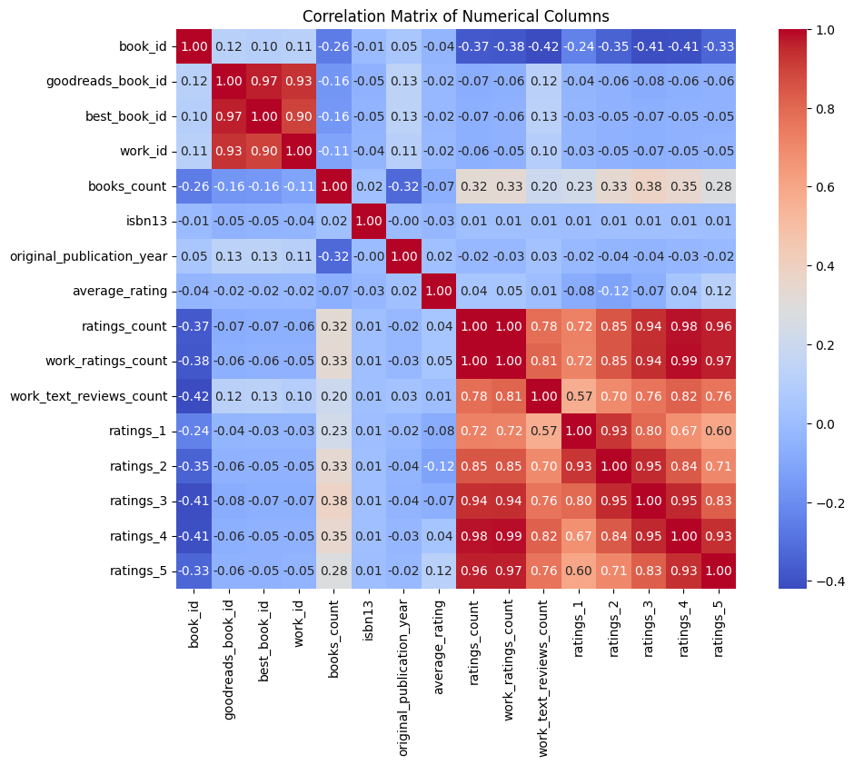

# Goodreads Books Dataset Analysis

Welcome to the comprehensive analysis of the Goodreads books dataset! This dataset contains a wealth of information about thousands of books, showcasing various attributes such as ratings, reviews, publication details, and author information. In this README, we will explore the dataset thoroughly, providing insights, visualizations, and recommendations for further analysis.

## Dataset Overview

The dataset consists of 10,000 entries with several numerical and categorical columns. Below, we summarize the columns available in the dataset:

### Numerical Columns
- **book_id**: Unique identifier for each book.
- **goodreads_book_id**: Goodreads-specific book identifier.
- **best_book_id**: Identifier for the 'best' version of a book.
- **work_id**: Unique identifier for the work.
- **books_count**: Number of editions available for this book.
- **isbn13**: International Standard Book Number (ISBN-13).
- **original_publication_year**: Year the book was originally published.
- **average_rating**: Average rating of the book.
- **ratings_count**: Total number of ratings received.
- **work_ratings_count**: Total ratings for the work.
- **work_text_reviews_count**: Number of text reviews for the work.
- **ratings_1** to **ratings_5**: Breakdown of ratings by score (1 to 5).

### Categorical Columns
- **isbn**: ISBN number.
- **authors**: Authors of the book.
- **original_title**: The original title of the book.
- **title**: The title of the book.
- **language_code**: Language in which the book is written.
- **image_url**: URL for the book's cover image.
- **small_image_url**: URL for a smaller version of the book's cover image.

### Missing Values Summary
Certain columns have missing values, notably:
- **isbn**: 700 missing values (7%)
- **isbn13**: 585 missing values (5.85%)
- **original_publication_year**: 21 missing values (0.21%)
- **original_title**: 585 missing values (5.85%)
- **language_code**: 1084 missing values (10.84%)

Addressing these missing values is crucial for ensuring the integrity of our analysis.

## Summary Statistics

Below is a summary of key statistical metrics from the numerical columns:

| Metric                         | Count       | Mean        | Std Dev      | Min         | Max         |
|--------------------------------|-------------|-------------|--------------|-------------|-------------|
| **Average Rating**             | 10,000      | 4.00        | 0.25         | 2.47        | 4.82        |
| **Ratings Count**              | 10,000      | 54,001      | 157,370      | 2,716       | 4,780,653   |
| **Work Ratings Count**         | 10,000      | 59,687      | 167,803      | 5,510       | 4,942,365   |
| **Books Count**                | 10,000      | 75.71       | 170.47       | 1           | 3,455       |

As we can see, the average book rating is inclined toward the higher end of the scale, suggesting that readers generally favor the books in the dataset.

## Correlation Analysis

The correlation matrix reveals relationships among numerical attributes. For instance, there is a strong correlation between:

- **ratings_count** and **work_ratings_count**: r = 0.995
- **ratings_4** and **ratings_count**: r = 0.978
- **ratings_5** and **ratings_count**: r = 0.964

These correlations suggest that as the number of ratings increases, the distribution of higher ratings (4 and 5-star ratings) also tends to increase.

## Visualizations

### Distribution of Ratings

Several histograms display the distribution of ratings across various parameters:

- **Histogram of Ratings Count**

This plot indicates that a majority of books received a moderate number of ratings, with some outliers showing very high ratings.

- **Histogram of Average Rating**

This distribution supports our earlier observation of high average ratings, with a noticeable cluster of books rated between 4.0 and 5.0.

- **Histogram of Ratings Breakdown**

These histograms illustrate how readers rate the books on a 1-5 scale, showing fewer low ratings and a gradual increase toward 5-star ratings.

### Publication Year Distribution

This histogram reveals a clear trend in publication years, with a growing number of books published in recent years. This may reflect an evolving interest or a growth in the publishing industry.

### Missing Values

In the analysis, we also prepared a visualization to capture missing data effectively:

Understanding and visualizing missing values can help to guide data cleaning efforts, ensuring quality support for models and analyses applied later.

## Recommendations

1. **Handling Missing Values**: It is recommended to assess the impact of missing values on the analysis. Consider imputation techniques for non-critical fields (e.g., filling missing `language_code` based on the modal value).

2. **Exploring Author Metrics**: Analyzing ratings based on authors can yield insights into trends in literature and reader preferences. 

3. **Temporal Analysis**: Analyzing how average ratings and books published have changed over time can reveal evolving reader preferences and trends in literature.

4. **Further Exploratory Data Analysis (EDA)**: Visualizing categorical data related to authors and their most successful works could illustrate patterns in the book's success across different genres and author backgrounds.

## Conclusion

The Goodreads books dataset presents numerous opportunities for exploration and insight into reader preferences across time and genre. By understanding the relationships among the different attributes and utilizing appropriate data cleaning and imputation techniques, we can extract meaningful insights that are valuable for authors, readers, and publishers alike. Thank you for engaging with this analysis and we encourage you to explore further!

