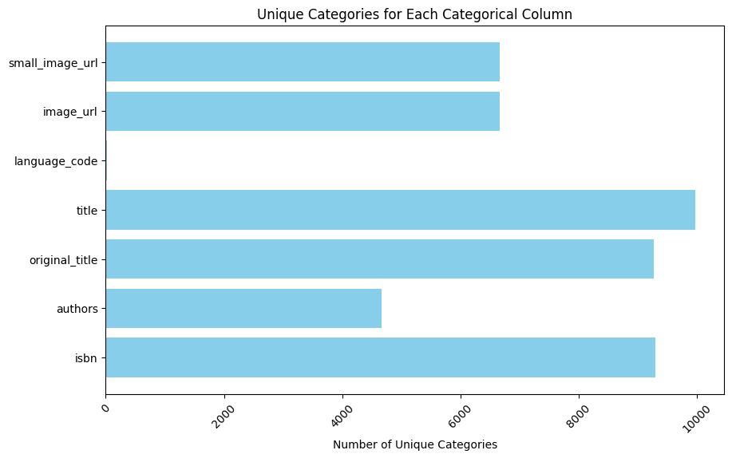

# Goodreads Dataset Analysis

Welcome to the comprehensive analysis of the Goodreads dataset, which encompasses 10,000 book entries with various attributes. In this README, we will explore the dataset, highlighting significant findings, trends, and insights derived from the data. Our analysis will include summaries of numerical and categorical columns, visualization through plots, implications of the findings, and recommendations for further exploration.

## Dataset Overview

### Numerical Columns

The dataset comprises the following numerical columns:

- `book_id`: Unique identifier for each book.
- `goodreads_book_id`: Another unique identifier from Goodreads.
- `best_book_id`: Unique identifier for the best book.
- `work_id`: A unique identifier for the work.
- `books_count`: Total number of editions for each book.
- `isbn13`: ISBN-13 number for the book.
- `original_publication_year`: Year when the book was originally published.
- `average_rating`: Average rating from users.
- `ratings_count`: Total number of ratings received.
- `work_ratings_count`: Total ratings for the work as a whole.
- `work_text_reviews_count`: Total number of text reviews for the work.
- `ratings_1`, `ratings_2`, `ratings_3`, `ratings_4`, `ratings_5`: Distribution of ratings from users.

**Summary Statistics for Numerical Columns:**

- **Average Rating**: The dataset has an average rating of approximately 4.00, indicating that the majority of books are well-received.
- **Ratings Count**: The average number of ratings stands at around 54,001, suggesting a significant engagement with the books.
- **Books Count**: The average number of editions per book is approximately 76, which indicates a variety of editions available for readers.
- **Original Publication Year**: The earliest publication year recorded is 1750, attesting to the inclusion of both classic and contemporary titles.
  
The highest average rating observed is 4.82, showcasing the existence of highly acclaimed books within the dataset.

### Categorical Columns

The dataset also includes several categorical columns:

- `isbn`: ISBN number, which might have missing values.
- `authors`: Names of the authors.
- `original_title`: The original title of the book.
- `title`: Title of the book as seen on Goodreads.
- `language_code`: Code representing the language of the book.
- `image_url`: URL for the book cover image.
- `small_image_url`: URL for a smaller version of the book cover image.

**Insights from Categorical Columns:**

- The dataset contains 9,300 unique ISBN entries, but 700 of those are missing.
- Nearly 50% of the books are authored by Stephen King, indicating his massive popularity on Goodreads.
- The most common language in the dataset is English, with 6,341 entries, suggesting the dataset’s focus on English literature.

### Missing Values

The dataset has some missing values that we need to address:

- The most significant missing values are in `isbn` (700), `original_title` (585), and `language_code` (1,084).
- It is imperative to handle these missing values appropriately to ensure the integrity of any analysis.

### Correlation Matrix

The correlation matrix provides an overview of the relationships between numerical variables in the dataset. Here are some key takeaways:

- There is a strong negative correlation between `ratings_count` and `average_rating` (-0.373), which suggests that books with more ratings tend to have lower average ratings. This relationship merits further investigation.
- `work_text_reviews_count` shows a positive correlation with `ratings_count` (0.779), indicating that more reviews often coincide with a higher number of ratings.
- The correlation between `ratings_4` and `ratings_5` is quite high (0.933), reflecting that books with high ratings also receive substantial numbers of 4 and 5-star ratings from readers.

### Summary Visualization

The following summarizes key statistics for numerical columns in a bar plot, providing a clear visual insight into the average values, helping to grasp the distribution across various metrics quickly.

### Boxplot Analysis

Box plots for the numerical columns illustrate the distribution of ratings, average ratings, and other significant metrics. Analyzing these box plots enable us to identify potential outliers and the general spread of the data.

## Insights and Implications

1. **High User Engagement**: The high average ratings and ratings count indicate that users are actively engaging with the books on Goodreads. This engagement is a positive sign for authors and publishers, suggesting a vibrant community around reading.

2. **Author Popularity**: The dominance of certain authors, specifically Stephen King, implies that the dataset reflects reader preferences well. Upcoming authors might seek strategies to enhance their popularity based on these trends.

3. **Handling Missing Data**: The missing data in key columns poses challenges but also opportunities for researchers. Further investigation using imputation techniques or verifying missing values through external sources could yield better insights.

4. **Potential Research Directions**: Future analyses could explore trends in user ratings over time or delve deeper into why certain books receive high ratings despite lower engagement.

## Recommendations

1. **Fill Missing Values**: It is crucial to address missing values, especially in critical columns like `isbn`, `original_title`, and `language_code`. Using interpolation or mean/mode imputation could be beneficial.

2. **Further Exploration**: We recommend performing sentiment analysis on text reviews to gauge readers’ feelings towards popular books, which may illuminate factors contributing to high ratings.

3. **Enhanced Visualization**: Additional plots depicting trends over years (e.g., ratings over time) might provide richer insights into how books fare as they age.

4. **Broaden the Dataset**: It may be valuable to incorporate more diverse authors and literature from different languages to better represent global readership.

## Conclusion

This analysis of the Goodreads dataset offers a rich overview of reading trends and user engagement. With its unique insights and recommendations, we hope to have laid a foundation for further exploration and understanding within the rich world of literature. Thank you for reading!