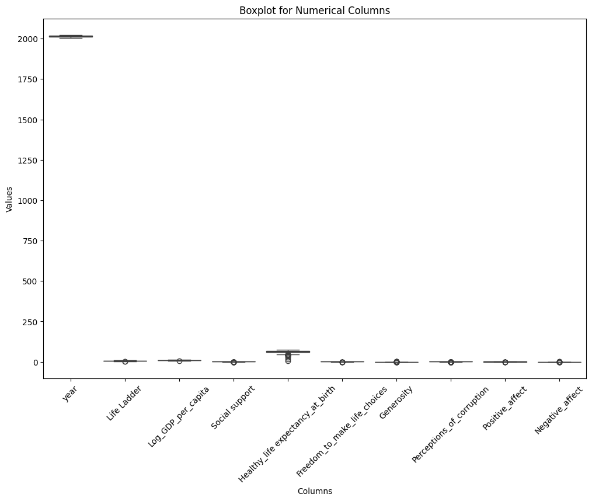

```markdown
# Exploring Happiness and Its Implications Across Countries

## Overview
This dataset encompasses 2,363 records, detailing various aspects of happiness across different countries over a span of years. It contains both numerical and categorical data that sheds light on the factors contributing to the perceived quality of life in different regions.

### Data Composition
- **Numerical Columns**: 
  - `year`
  - `Life Ladder`
  - `Log_GDP_per_capita`
  - `Social support`
  - `Healthy_life expectancy_at_birth`
  - `Freedom_to_make_life_choices`
  - `Generosity`
  - `Perceptions_of_corruption`
  - `Positive_affect`
  - `Negative_affect`

- **Categorical Columns**: 
  - `Country_name`

### Summary Statistics
The summary statistics reveal significant insights about the available data:

- **Year**: The dataset spans from 2005 to 2023, with an average year of approximately 2014.76.
- **Life Ladder**: Reflects happiness, with an average score of 5.48, which indicates a moderate level of happiness across countries.
- **Log GDP per capita**: Average value stands at approximately 9.4, signifying varied economic well-being among different nations.
- **Social Support**: The mean support score is 0.809, suggesting that countries, on average, provide effective social support for their citizens.
- **Healthy Life Expectancy**: Average expectancy at birth is about 63.4 years, reflecting health status across various regions.
- **Freedom to Make Life Choices**: A mean score of 0.75 indicates a significant degree of freedom, critical for overall happiness.
- **Generosity**: With a near-zero mean value, it suggests that financial and altruistic contributions might not be strong metrics in this dataset.
- **Perceptions of Corruption**: The average score of 0.744 may reflect varying levels of trust within different governments.
- **Positive Affect**: An average of 0.652 indicates a generally positive emotional environment.
- **Negative Affect**: Average score indicates a presence of negative feelings, with 0.273 being a considerable hurdle for happiness.

#### Visual Representation of Data Insights
To further illustrate the findings, the following plots provide a visual insight into the dataset's characteristics:

1. **Missing Values**: This plot details the percentage of missing values for each column. Notably, `Generosity` has 81 missing entries, which signifies a potential area for data improvement.
   

2. **Mean as Bar Plots**: This plot visualizes the mean values of the numerical columns, clearly highlighting key averages that define the dataset.
   

3. **Correlation Matrix**: The correlation matrix reveals significant relationships between variables. For example, `Log_GDP_per_capita` shows a strong positive correlation with both `Life Ladder` (0.78) and `Healthy Life Expectancy` (0.82). These correlations suggest that economic prosperity and longevity are deeply intertwined with perceived happiness levels.
   

4. **Boxplot of Numerical Columns**: This plotting method visually represents the distribution of numerical variables, showcasing outliers and the spread of data points across different columns.
   

### Insights and Analysis

Upon reviewing the data and plots, several key insights emerge:

- **Economic Influence on Happiness**: The strong correlation between GDP per capita and happiness measures underscores the importance of economic conditions in shaping life quality. It suggests that policies promoting economic growth could positively impact citizens' happiness.

- **Social Support and Freedom**: The high average scores for social support and freedom to make life choices indicate that these factors are crucial in enhancing happiness levels. Countries looking to improve happiness indices should consider bolstering these areas.

- **Generosity and Corruption**: The minimal scores for generosity might highlight a cultural aspect, where monetary altruism is not commonplace. Meanwhile, lower perceptions of corruption are linked with higher happiness, inferring that trust in government fosters a better quality of life.

### Recommendations

1. **Data Improvement**: Focus on collecting more data regarding `Generosity` and `Perceptions of Corruption`, which have notable missing values. This would enhance the dataset's richness and reliability.

2. **Country-Specific Analysis**: Conduct detailed analyses for countries that deviate significantly from the average in happiness scores. Understanding these anomalies could provide insights for both policymakers and researchers.

3. **Policy Implications**: Governments should prioritize improving social support structures and promoting economic growth, considering that these factors are strongly associated with increased happiness levels.

4. **Further Research**: Encourage research initiatives that delve into the subjectivity of happiness, incorporating qualitative aspects such as individual experiences and societal norms, to complement the quantitative data available in this dataset.

### Conclusion
This dataset serves as a vital resource for exploring the multifaceted nature of happiness across countries. By integrating numerical analyses alongside visual representations, a deeper understanding of the elements that contribute to happiness can be achieved. Harnessing these insights can foster initiatives aimed at improving well-being on a global scale.
```
