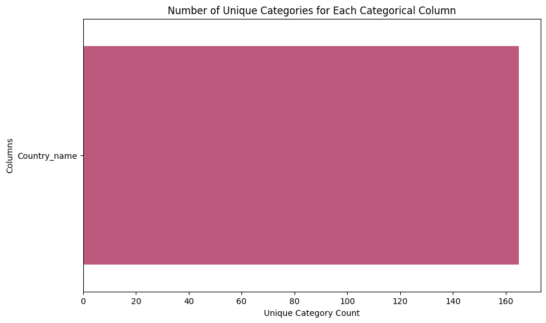

# Happiness Dataset Analysis

## Overview

The happiness dataset provides intriguing insights into factors influencing life satisfaction across different countries from the year 2005 to 2023. This dataset comprises a total of 2,363 entries and includes both numerical and categorical data, encapsulating a variety of indicators believed to impact a person's quality of life.

### Columns Description

- **Year**: The year the data was recorded. It ranges from 2005 to 2023, giving us insights into trends over time.
- **Life Ladder**: A subjective measure of happiness where higher values indicate greater life satisfaction.
- **Log_GDP_per_capita**: The logarithm of GDP per capita, providing an economic perspective of affluence and its correlation with happiness.
- **Social Support**: Measures the perceived level of support from family, friends, and the community.
- **Healthy Life Expectancy at Birth**: This indicates the average number of years a newborn can expect to live in good health.
- **Freedom to Make Life Choices**: This column encapsulates the degree of freedom individuals feel they have in making essential life decisions.
- **Generosity**: Measures the amount of charitable giving and altruistic behavior.
- **Perceptions of Corruption**: A measure indicating the extent to which people believe corruption exists in government and business.
- **Positive Affect**: This assesses the frequency of experiencing positive emotions like joy and satisfaction.
- **Negative Affect**: In contrast, this measures the frequency of experiencing negative emotions like sadness and anger.

### Summary Statistics

The dataset provides valuable summary statistics for the numerical columns. Below are some key takeaways from the data:

- The average **Life Ladder** score is approximately **5.48**, with a range from **1.28** to **8.02**. This suggests a diverse level of happiness among different countries.
- The **Log_GDP_per_capita** averages **9.40**, indicating economic variance, with the minimum recorded value of **5.53** suggesting some poorer nations in the dataset.
- **Social Support** and **Healthy Life Expectancy at Birth** exhibit mean values of **0.81** and **63.40** years, respectively, showing the importance of community and health in influencing happiness.
- On the other hand, **Generosity** is notably low, with an average close to zero, implying a lack of significant charitable behavior in the dataset.

The presence of missing values is notable across several columns. For instance, the **Generosity** column has **3.43%** missing values, demonstrating an area needing attention for complete analysis. 


### Correlation Analysis

The **correlation matrix** reveals several significant relationships within the data:

- A strong positive correlation (0.78) exists between **Life Ladder** and **Log_GDP_per_capita**, suggesting that wealthier nations tend to have higher happiness levels.
- **Social Support** also shows a significant positive correlation with **Life Ladder (0.72)**, affirming the role of community connections in enhancing life satisfaction.
- Interestingly, **Perceptions of Corruption** demonstrate a negative correlation with **Life Ladder** (-0.43), indicating that higher perceived corruption leads to lower happiness.


### Visualizations

In addition to correlations, we can visualize the distribution of numerical data and summary statistics through various plots. Below are interpretations from the generated plots.

#### Mean as Bar Plots

The bar plots give a clear visualization of average values for each numerical column. They visually emphasize how economic stability, social support, and health appear to be critical contributors to overall happiness.



#### Box Plots for Numerical Columns

Box plots provide insights into the distribution and presence of outliers within the numerical variables. For instance, one might observe that while most countries score low on **Generosity**, a few outlier countries display significantly higher generosity levels.


### Insights and Recommendations

From the data analysis, several insights emerge:

- **Key Drivers of Happiness**: Economic factors (like GDP per capita) and social support systems appear to be the most vital contributors to national happiness. Policymakers should focus on strengthening these areas to improve overall life satisfaction.
- **Addressing Corruption**: Countries exhibiting high perceptions of corruption also report lower happiness levels. Initiatives aimed at reducing corruption can have positive ripple effects on citizens' happiness.
- **Fostering Generosity**: Given the surprisingly low average in generosity, social programs encouraging community assistance and charity could help improve societal happiness levels.

### Conclusion

The happiness dataset serves as a valuable resource for understanding the multi-faceted nature of human satisfaction. By recognizing the elements that correlate with happiness, governments and organizations can develop targeted strategies to enhance the quality of life for their residents.

It is essential to continue research and update this dataset, including addressing missing values to ensure comprehensive analysis. Future studies might delve deeper into how cultural factors influence these indicators across different nations and over time.
```
