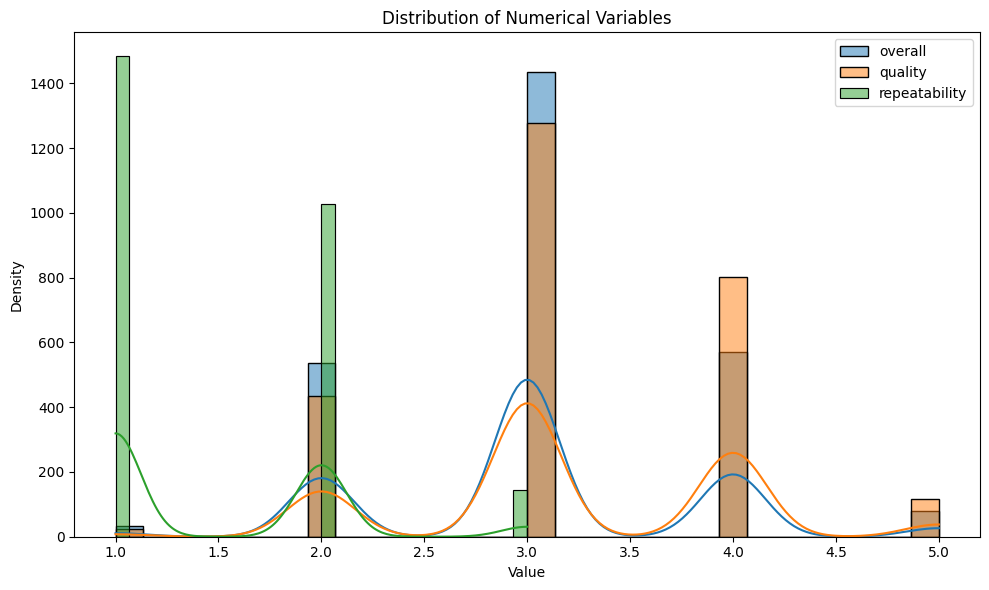
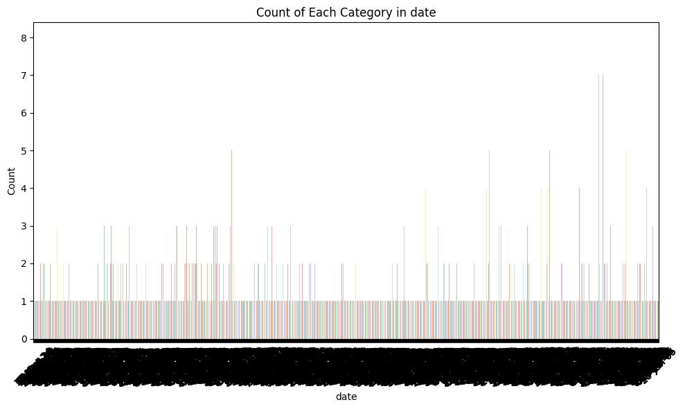
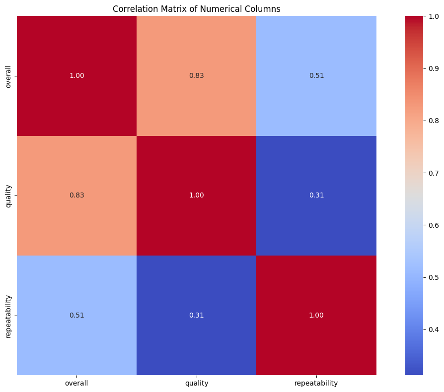
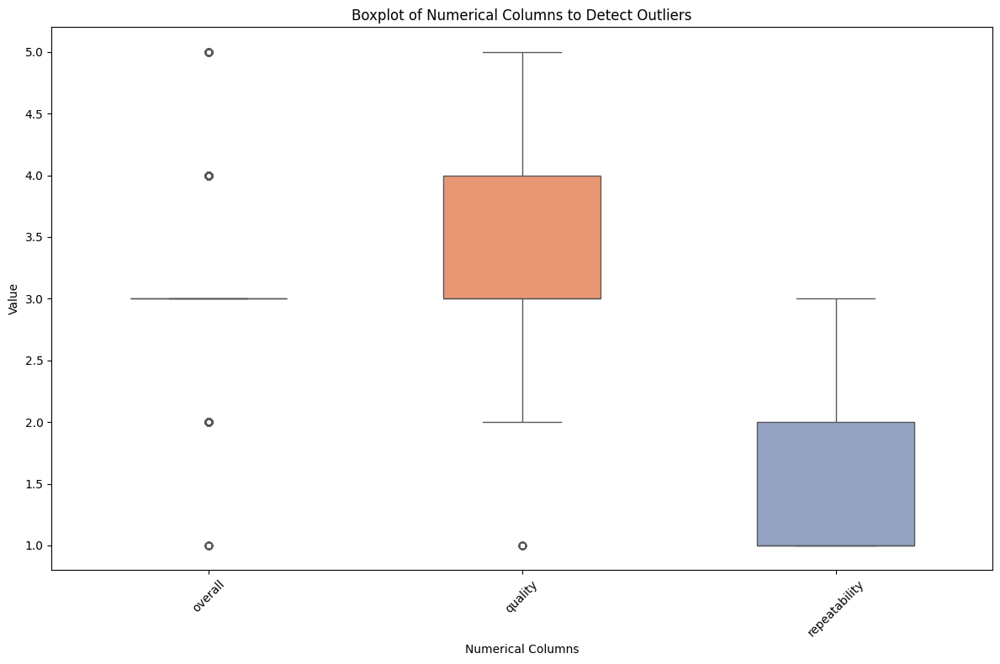

# Data Analysis Story: Exploring the Dataset

## Overview

In this analysis, we delve into a rich dataset comprising both numerical and categorical features. The dataset encapsulates various attributes including overall ratings, quality, repeatability, and metadata such as date, language, type, title, and the author. Our exploration reveals significant insights into the patterns and distributions of these features.

## Numerical Columns Summary

The numerical columns in our dataset are `overall`, `quality`, and `repeatability`. Let's explore their summary statistics:

- **Overall**
  - **Count**: 2652
  - **Mean**: 3.05
  - **Standard Deviation**: 0.76
  - **Minimum**: 1
  - **Maximum**: 5
  - The overall ratings range from 1 to 5, with the mean around 3, suggesting a slightly above-average general sentiment. The distribution is tightly clustered as indicated by the low standard deviation.

- **Quality**
  - **Count**: 2652
  - **Mean**: 3.57
  - **Standard Deviation**: 0.75
  - **Minimum**: 1
  - **Maximum**: 5
  - The quality ratings also lean toward a positive outlook, as seen from the mean. Notably, there is potential for variance, seen with a standard deviation similar to that of the `overall` ratings.

- **Repeatability**
  - **Count**: 2652
  - **Mean**: 1.49
  - **Standard Deviation**: 0.60
  - **Minimum**: 1
  - **Maximum**: 3
  - The repeatability values indicate a narrower band, representing consistent yet lower ratings compared to overall and quality measures.

### Visual Representation of Numerical Variables

The distribution plot highlights that while most records cluster around the mean for `overall` and `quality`, the `repeatability` variable skews towards its lower end. This insight into distributions can help focus attention on improving repeatability as it seems to be a weaker aspect of the dataset.

## Categorical Columns Summary

The categorical columns consist of `date`, `language`, `type`, `title`, and `by`. 

- **Date**
  - **Count**: 2553
  - **Unique**: 2055
  - **Most Frequent**: 21-May-06, occurring 8 times
  - The date field has considerable uniqueness, indicating diverse entries. The low frequency of a single date may hint at a day of significant entries or events.

- **Language**
  - **Count**: 2652
  - **Unique**: Various but completely filled.
  - The language column does not have any missing entries, which is a positive sign for data completeness.

- **Type**
  - **Count**: 2652
  - **Unique**: Various but completely filled.
  - Similar to `language`, the `type` column shows no missing values, ensuring we have a full representation of entry types.

- **Title**
  - **Count**: 2652
  - **Unique**: Various but completely filled.
  - The titles possess diversity as well and do not present missing data.

- **By**
  - **Count**: 2390
  - **Unique**: 1528
  - **Most Frequent**: Kiefer Sutherland, with a frequency of 48
  - This column suffers from a higher percentage of missing values (9.88%). This could impede analyses aiming to correlate `by` with numerical metrics.

### Visualizing Categorical Data

The count plot generated provides visual insight into the number of entries per category, indicating the diversity and frequency of contributions from various authors or types.

## Missing Values Analysis

The missing values plot indicates that only a couple of columns (`date` and `by`) have missing data, which is crucial for any future statistical analysis. Addressing the missing values in the 'by' column first should be prioritized, given its significance and the potential insights lost.

## Correlation Analysis

The correlation matrix reveals intriguing interrelationships among the numerical columns:
- The highest correlation is between `overall` and `quality` (0.82), suggesting that improving quality ratings may significantly enhance overall ratings.
- Moderate correlation exists between `overall` and `repeatability` (0.51), indicating that repeatability also plays a role but is not as strongly related to overall sentiments.

### Box Plots of Numerical Columns

The boxplot for numerical columns displays the spread and central tendency of these metrics. Here, we see how susceptible the overall and quality scores are to outliers, allowing us to understand the moderation in these ratings, urging the need for further examinations on the extreme values in `repeatability`.

## Recommendations

1. **Focus on Improving Repeatability**: Given its lower mean score and significant correlation with overall ratings, efforts should be directed towards initiatives that enhance consistency (i.e., repeatability) in the dataset.
2. **Address Missing Values in 'By'**: The `by` field should be the top candidate for data imputation or collection strategies to ensure comprehensive analyses, especially regarding author impact.
3. **Deepen Analysis on Quality Ratings**: Since quality is closely linked with overall satisfaction, more nuanced studies could reveal factors that drive quality perceptions.
4. **Monitor Temporal Trends**: The date attribute can provide insights into how ratings change over time; thus, time series analyses could prove insightful.

## Conclusion

This dataset offers a compelling mix of numerical and categorical insights within a structured format. Each analysis pathway presents a unique angle to tackle as we work towards understanding and improving the undercurrents within the dataset. Leveraging the visualized data can guide strategic decisions, foster equitable analyses, and unearth underlying trends and patterns. Ultimately, the combined insights can significantly enhance future outcomes.
