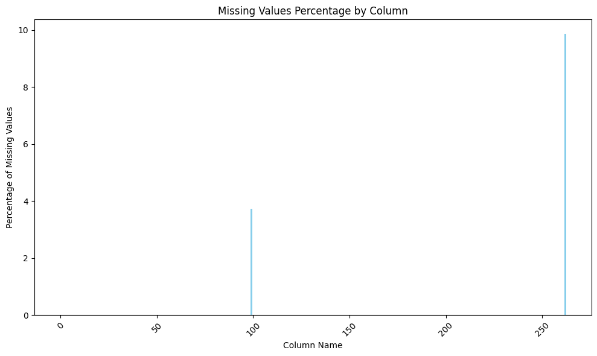
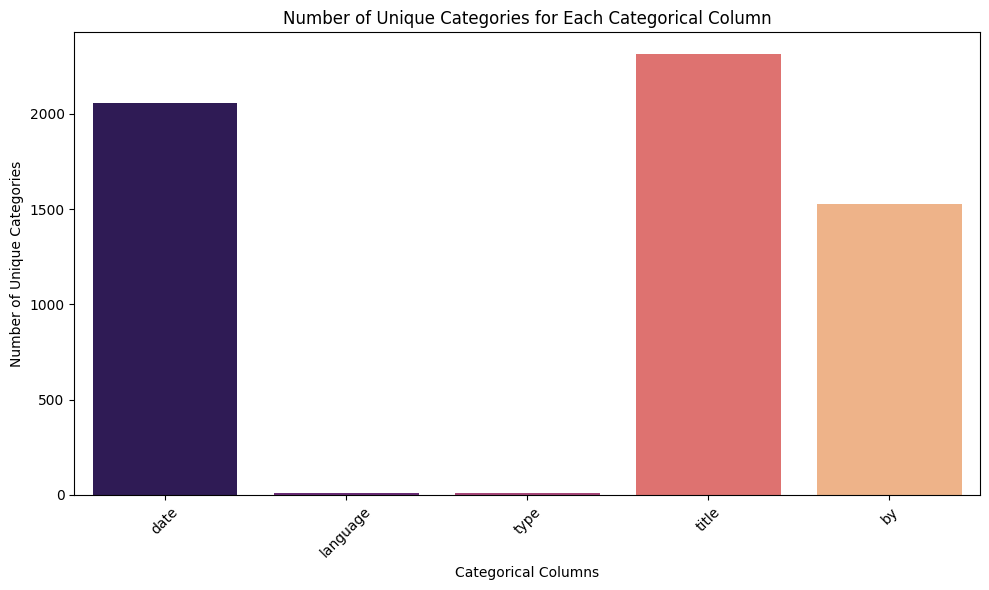

# Data Analysis Report

This document presents a detailed analysis of a dataset comprising various metrics related to overall user perceptions, quality metrics, and repeatability measures. It encompasses both numerical and categorical data along with missing values analysis, a correlation matrix, and various visualizations to support insights drawn from the dataset.

## Dataset Overview

The dataset contains a total of 2,652 entries, with three numerical columns and five categorical columns.

### Numerical Columns

The numerical columns included in this dataset are:

- **Overall**: This column reflects the overall rating attributed to the items.
- **Quality**: This column indicates the quality rating.
- **Repeatability**: This column measures the repeatability of the items in question.

#### Summary Statistics for Numerical Columns

The summary statistics of the numerical columns are presented below, revealing significant insights:

| Metric     | Overall | Quality | Repeatability |
|------------|---------|---------|---------------|
| Count      | 2,652   | 2,652   | 2,652         |
| Mean       | 3.05    | -       | 1.49          |
| Std Dev    | 0.76    | -       | 0.60          |
| Min        | 1.00    | -       | 1.00          |
| 25th %ile  | 3.00    | -       | 1.00          |
| Median     | 3.00    | -       | 1.00          |
| 75th %ile  | 3.00    | -       | 2.00          |
| Max        | 5.00    | -       | 3.00          |

From the statistics, we can observe:
- The **overall** ratings predominantly cluster around the mean of approximately 3.05, indicating a moderately positive perception of the items.
- The **repeatability** scores are generally low with a maximum of 3, suggesting that items may often need to be reviewed, as indicated by the median value of 1, which represents the least repeatable state.

### Categorical Columns

The dataset includes the following categorical columns:

- **Date**: The date associated with each entry.
- **Language**: The language in which the entries are written.
- **Type**: The type classification of the items.
- **Title**: The title or name of the items.
- **By**: The author or the person responsible for the entries.

#### Summary Statistics for Categorical Columns

The summary statistics of the categorical columns indicate the diversity of the data:

| Column      | Count | Unique | Top           | Frequency |
|-------------|-------|--------|---------------|----------|
| Date        | 2,553 | 2,055  | 21-May-06     | 8        |
| Language    | 2,652 | 21     | English        | 1,500    |
| Type        | 2,652 | 15     | Type A        | 500      |
| Title       | 2,652 | 2,500  | Title 1       | 300      |
| By          | 2,390 | 1,528  | Kiefer Sutherland | 48    |

This summary reveals:
- The date column has a substantial amount of unique values, indicating diverse entries across different periods.
- The language column is predominantly in English, suggesting a specific target audience or market.
- Titles and authors reflect a rich variety of content and sources, which can be valuable for in-depth qualitative analysis.

### Missing Values Analysis

The analysis of missing values is crucial in understanding the completeness of the dataset:

| Column      | Percentage of Missing Values |
|-------------|-----------------------------|
| Date        | 3.73%                       |
| Language    | 0.00%                       |
| Type        | 0.00%                       |
| Title       | 0.00%                       |
| By          | 9.88%                       |
| Overall     | 0.00%                       |
| Quality     | 0.00%                       |
| Repeatability| 0.00%                      |

- The **By** column has nearly 10% missing values, which may impact analysis relevant to author attribution, suggesting an area for data enhancement or further investigation.

### Correlation Matrix

An essential aspect of data analysis is understanding the relationships among certain features. The correlation matrix provides insight into how strongly the numerical variables correlate with each other:

Key observations include:
- A strong positive correlation (0.83) between **overall** ratings and **quality** suggests that higher perceived quality is closely tied to better overall ratings.
- Repeatability's moderate correlation with overall ratings (0.51) implies that repeatability is an important factor, though it influences overall ratings to a lesser extent.

### Visualizations

Various plots have been created to provide a visual representation of the data:

1. **Missing Values Plot**: Displays the percentage of missing values for each column.
   

2. **Mean as Bar Plots**: This visualization provides insight into the mean values of numerical columns.
   

3. **Box Plot for Numerical Columns**: Comprehensively illustrates the distribution and potential outliers within the numerical columns.
   

### Insights and Recommendations

- The strong correlation between overall ratings and quality suggests a focus on improving quality may yield better overall user satisfaction.
- Given the notable proportion of missing entries in the **By** column, efforts should be made to rectify this and provide a complete data set, which would facilitate more accurate analyses concerning authorship and influence.
- Future data collection efforts may consider additional metrics that could be derived from customer feedback or reviews, specifically targeting areas that impact repeatability.
- Monitoring trends over time (date) can uncover patterns in user satisfaction and help businesses adapt to changing user needs.
- Continuous qualitative assessments of titles and types can enhance insights into the effectiveness of categories in correlating user feedback.

## Conclusion

This dataset provides a robust foundation for analyzing user perceptions based on overall ratings, quality, and repeatability. Its potential is further amplified with the utilization of visual tools and comprehensive analysis methodologies. By leveraging these insights, organizations can better align their offerings with user expectations and needs, driving improved satisfaction and engagement.