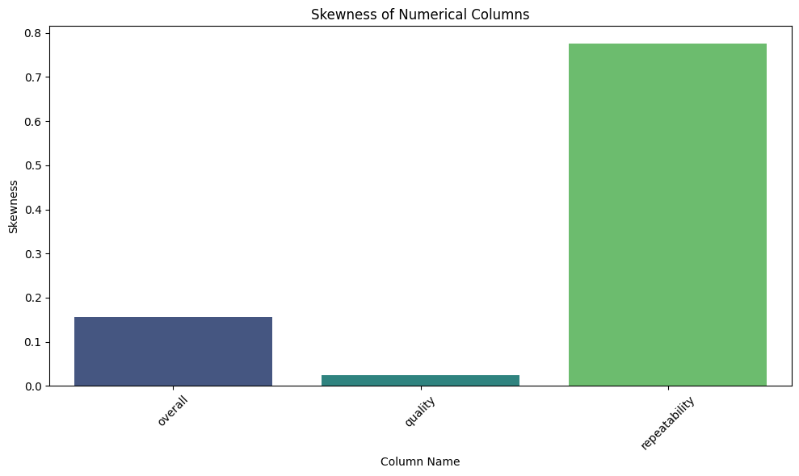

# Data Analysis Story

## Overview
In this analysis, we delve into a dataset comprised of various numerical and categorical columns. The aim is to glean insights from the data, highlighting the relationships among numerical features and observing the categorical attributes. The dataset is composed of 2,652 records with variable summaries that span across numerical and categorical data types. 

### Numerical Columns
The relevant numerical columns in the dataset are as follows:
- `overall`: This column indicates a general assessment, potentially rating a certain aspect associated with the dataset.
- `quality`: This column appears to serve a similar purpose as `overall`, though it might focus specifically on the quality of the items recorded.
- `repeatability`: This variable likely assesses how consistently a measured value can be reproduced.

#### Summary Statistics of Numerical Columns
- **Overall Statistics**:
    - Count: 2,652
    - Mean: 3.05
    - Standard Deviation: 0.76
    - Minimum: 1
    - 25th Percentile: 3
    - 50th Percentile (Median): 3
    - 75th Percentile: 3
    - Maximum: 5

Given these statistics, we observe that the mean ratings for both `overall` and `quality` are around 3, suggesting a central tendency towards this value. The repeatability average is 1.49, which is notably lower than the others, hinting that this measurement may have a lesser variance in assessment.

### Categorical Columns
The categorical attributes include:
- **Date**: Represents when each record was created or observed.
- **Language**: Indicates the language of the record.
- **Type**: Differentiates the nature of the record, potentially serving as classifications.
- **Title**: Likely the title relevant to each record.
- **By**: Indicates the creator or author associated with the record.

#### Summary Statistics of Categorical Columns
- `date`: 2,553 records (3.73% missing)
- `language`: 2,652 records (0% missing)
- `type`: 2,652 records (0% missing)
- `title`: 2,652 records (0% missing)
- `by`: 2,390 records (9.88% missing)

Overall, the `by` column has significant missing data, which could reflect a lack of documented information on authorship in those cases. 

### Missing Values Analysis
The table below summarizes the missing values in the dataset:

| Column Name | Percentage Missing |
|-------------|---------------------|
| date        | 3.73%               |
| language    | 0.00%               |
| type        | 0.00%               |
| title       | 0.00%               |
| by          | 9.88%               |

#### Insights on Missing Values
The percentage of missing values in the `date` and `by` columns indicates areas for potential data collection improvement. Addressing the missing values by either imputing them or gathering additional data could enhance the quality of analysis in those aspects.

### Correlation Analysis
A correlation matrix was computed to examine the linear relationships among numerical columns:

|               | Overall | Quality | Repeatability |
|---------------|---------|---------|---------------|
| Overall       | 1.00    | 0.83    | 0.51          |
| Quality       | 0.83    | 1.00    | 0.31          |
| Repeatability  | 0.51    | 0.31    | 1.00          |

#### Observations
- The correlation between `overall` and `quality` is notably high (0.83), demonstrating a strong relationship. This suggests that as the overall rating increases, the quality rating tends to align closely.
- A moderate correlation exists between `overall` and `repeatability` (0.51), indicating reasonable consistency with overall assessments.

### Visual Insights 
#### Skewness

The skewness in the data showcases any inequalities around the mean, revealing how the ratings are distributed. The mathematical measure indicates that 'overall' ratings are slightly skewed towards the higher scores.

#### Mean as Bar Plots

The bar plots depict the mean of numerical features, prominently illustrating the average scores it's capturing. This gives a clear graphical representation of where perceptions lie on the scale.

#### Box Plot for Numerical Columns

Box plots provide a visual representation of the range of values along with potential outliers in the numerical data, which measures the spread of data and its central tendency.

### Recommendations
1. **Data Enrichment**: Explore methods to fill in the missing values, particularly in the `by` column, as it may provide significant insights into the authors.
2. **Feature Engineering**: Given the high correlation between `overall` and `quality`, consider deriving a composite score that combines multiple evaluations into one metric.
3. **Further Analysis**: Utilize visualizations to explore additional relationships among categorical features, which may uncover patterns in types or languages concerning overall ratings and quality.

### Conclusion
The dataset presents substantial opportunities for analysis through its detailed numerical summaries and categorical dimensions. The insights gained through correlation analysis, as well as visual representations, provide a robust foundation for understanding the underlying patterns within the data. Moving forward, addressing missing values, delving deeper into categorical explorations, and enriching the dataset could furnish clearer insights and better inform decision-making.

Be sure to maintain these practices as you continue to analyze and derive value from the dataset. Happy data crunching!