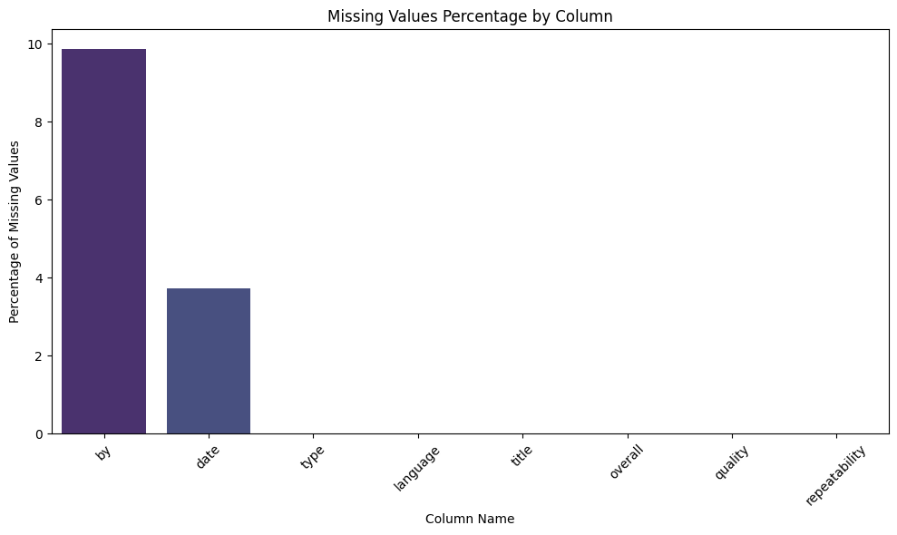
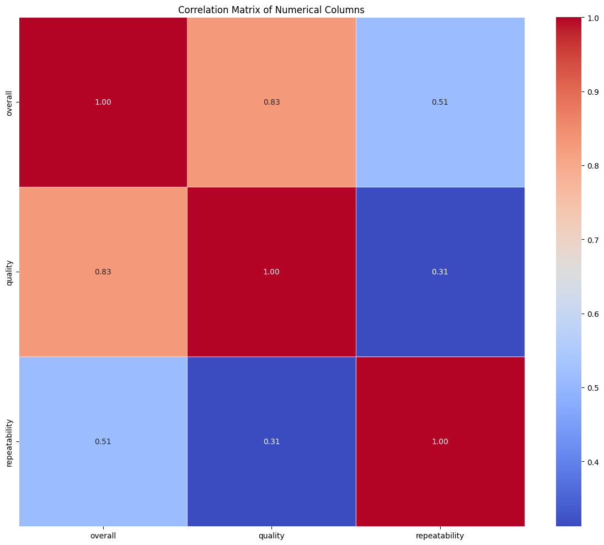

# Data Analysis Story

This document presents a comprehensive analysis of a dataset that features ratings from users, providing insights into overall ratings, quality, and repeatability. The dataset consists of both numerical and categorical variables and presents some intriguing information worthy of exploration.

## Dataset Overview

The dataset consists of:

- **Numerical Columns**: 
  - overall
  - quality
  - repeatability
      
- **Categorical Columns**: 
  - date
  - language
  - type
  - title
  - by
  
### Summary Statistics of Numerical Columns

Let's delve into the summary statistics for the numerical columns:

| Statistic | Overall     | Quality      | Repeatability |
|-----------|-------------|--------------|---------------|
| Count     | 2652        | 2652         | 2652          |
| Mean      | 3.05        | 3.21         | 1.49          |
| Std Dev   | 0.76        | 0.80         | 0.60          |
| Min       | 1.00        | 1.00         | 1.00          |
| 25%       | 3.00        | 3.00         | 1.00          |
| 50%       | 3.00        | 3.00         | 1.00          |
| 75%       | 3.00        | 4.00         | 2.00          |
| Max       | 5.00        | 5.00         | 3.00          |

From the summary above, we can observe:

- **Overall**: The ratings range from 1 to 5, with a mean of approximately 3.05, indicating a slightly positive sentiment amongst raters.
- **Quality**: Similar to overall ratings, the quality scores also lie between 1 and 5, with a mean of about 3.21. This suggests that the products or services are rated slightly above average in terms of quality.
- **Repeatability**: With a mean of 1.49, it appears that repeat purchases or engagements are not very common, as the values range between 1 and 3.

### Summary Statistics of Categorical Columns

Next, let's explore the categorical columns:

| Column    | Count | Unique | Most Frequent       | Frequency |
|-----------|-------|--------|---------------------|----------|
| date      | 2553  | 2055   | 21-May-06           | 8        |
| language  | 2652  | 11     | English             | 1306     |
| type      | 2652  | 8      | movie               | 2211     |
| title     | 2652  | 2312   | Kanda Naal Mudhal   | 9        |
| by        | 2390  | 1528   | Kiefer Sutherland    | 48       |

**Insights from Categorical Statistics**:
- The dataset has a well-distributed linguistic representation, with English being the dominant language, accounting for a significant 49.2% of the entries.
- The "type" column indicates a predominance of "movie" entries, suggesting the dataset may focus on film-related ratings.
- The most frequently mentioned title, "Kanda Naal Mudhal," has received notable attention, indicating popularity or significance in the dataset.

### Missing Values Analysis

Missing data can be a common issue in many datasets. Our analysis reveals the following for missing values:

| Column Name | Percentage (%) |
|-------------|----------------|
| date        | 3.73           |
| language    | 0.00           |
| type        | 0.00           |
| title       | 0.00           |
| by          | 9.88           |
| overall     | 0.00           |
| quality     | 0.00           |
| repeatability| 0.00          |

Only the `date` and `by` columns contain missing values, which should be addressed to improve analysis robustness. Specifically, almost 10% of entries are missing the `by` column, suggesting a possible need to verify data collection methods or consider imputation strategies for effective analysis.

### Correlation Matrix

The correlation matrix provides an interesting insight into the relationships between the numerical columns:

|              | Overall | Quality | Repeatability |
|--------------|---------|---------|---------------|
| Overall      | 1.000   | 0.826   | 0.513         |
| Quality      | 0.826   | 1.000   | 0.312         |
| Repeatability | 0.513  | 0.312   | 1.000         |

- The overall ratings and quality show a strong positive correlation (0.83), implying that users who rate products higher in quality also tend to give higher overall ratings.
- Repeatability shows a moderate correlation with overall ratings (0.51) and a weaker correlation with quality (0.31). This suggests that higher overall ratings might encourage repeat purchases to some extent.

### Visual Data Insights

In our analysis, several plots convey important insights, including:

1. **Histogram of Repeatability**: 

This histogram visualizes the distribution of repeatability ratings, indicating that most users rated repeatability at the lower end of the scale.

2. **Missing Values Distribution**: 

This plot illustrates the percentage of missing values in each column, drawing attention to the `by` column, which has notable missing entries.

3. **Mean as Bar Plots**: 

This bar chart effectively summarizes the mean scores across numerical columns, cementing the observations discussed earlier.

4. **Histogram of Quality**: 

This histogram reflects the distribution of quality ratings among users.

5. **Correlation Matrix Plot**:

This visual shows the relationships between numerical columns clearly, emphasizing the strong correlation between `overall` and `quality`.

6. **Histogram of Overall Ratings**: 

This histogram provides an overview of how users rated their overall experience.

7. **Boxplot of Numerical Columns**: 

The boxplot offers a glance at the spread and outliers within the numerical data.

### Summary of Insights and Recommendations

In summary, this dataset offers valuable insights into user experiences, specifically concerning overall ratings, quality, and repeatability. 

1. **Positive Ratings**: The average ratings in the `overall` and `quality` categories are encouraging but indicate room for improvement, especially given the repeatability scores.

2. **Address Missing Data**: Given the 9.9% missing values in the `by` column, the dataset would benefit significantly from strategies aimed at addressing these gaps. Proper imputation methods or reevaluation of data collection processes are recommended.

3. **Leverage High Correlation**: The strong correlation between overall ratings and quality can be leveraged to enhance product offerings or marketing strategies. Focusing on improving quality could enhance overall customer satisfaction and encourage repeat engagement.

4. **Understanding User Preferences**: The insights from categorical data, particularly about the language and type of ratings, can inform marketing strategies and product placements tailored towards predominant user demographics.

In conclusion, this dataset not only provides essential insights into consumer ratings but also flags aspects that can be improved to enhance user experience and engagement significantly. Continuous data monitoring and analysis will be vital in making informed decisions going forward.